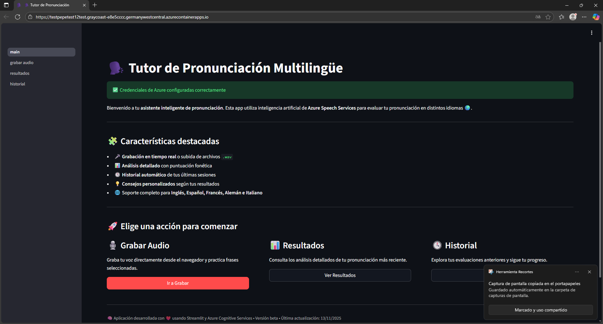
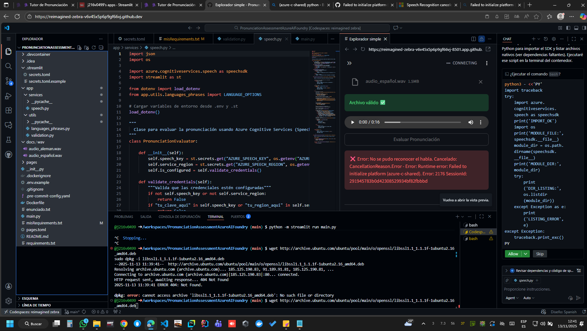
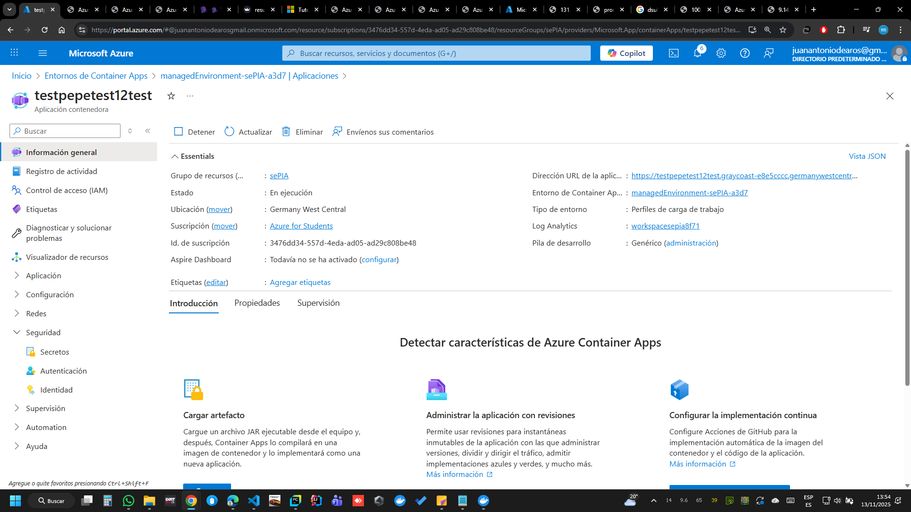
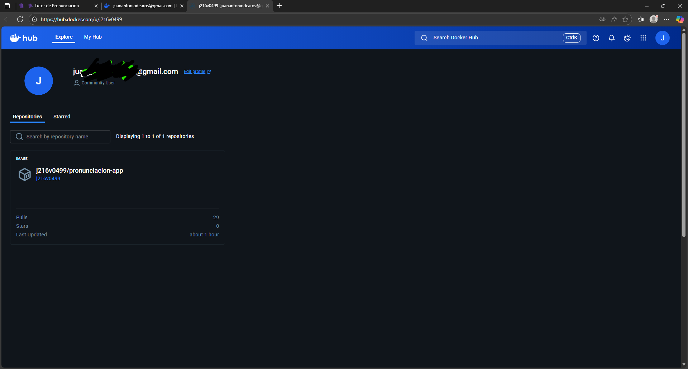
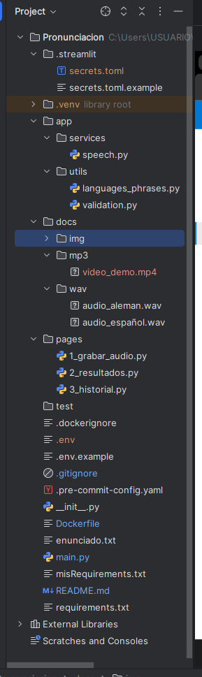
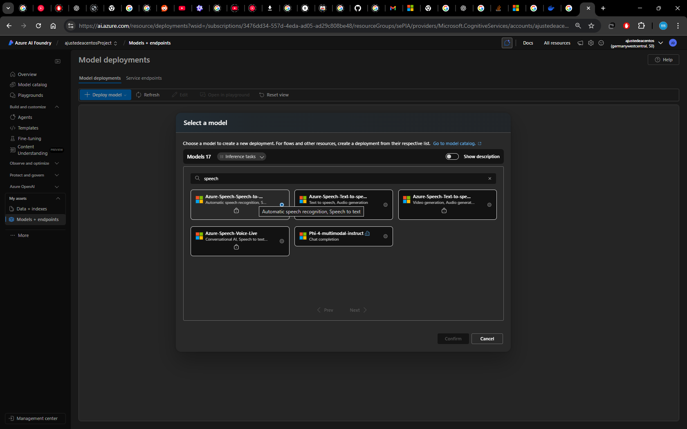

# 🗣️ Pronunciación — Evaluador de pronunciación con Azure Speech y Streamlit




Aplicación desarrollada en **Python + Streamlit + Docker +Azure** que permite grabar o subir tu voz, y obtener una **evaluación automática de pronunciación** gracias al servicio **Azure Cognitive Services Speech**.

Ideal para practicar idiomas y mejorar tu pronunciación con feedback inmediato.


---

## 🚀 Demo en línea

🧩 Prueba la aplicación en Streamlit Cloud(no funciona bien):  
👉 [https://j216v0499-pronunciationassessmentazureaifoundry-main-7nubzi.streamlit.app/](https://j216v0499-pronunciationassessmentazureaifoundry-main-7nubzi.streamlit.app/)

También disponible vía Azure Container Apps:  
👉 [https://testpepetest12test.graycoast-e8e5cccc.germanywestcentral.azurecontainerapps.io/](https://testpepetest12test.graycoast-e8e5cccc.germanywestcentral.azurecontainerapps.io/)

## ⚠️ Problemas con Streamlit Cloud

Si tienes errores al ejecutar la app en **Streamlit Cloud**, instala las dependencias de audio manualmente en el workshop, pero esto no afecta a los nuevos "clientes" que entren or la web, por eso se paso a docker+azure:

```bash
sudo apt-get update
sudo apt-get install -y libasound2-dev portaudio19-dev libpulse-dev ffmpeg
pip install --upgrade azure-cognitiveservices-speech

```

---

## ✨ Características principales

✅ Grabación de audio directamente desde el navegador.  
✅ Evaluación automática de pronunciación (precisión, fluidez y completitud).  
✅ Historial de resultados con puntuaciones detalladas.  
✅ Compatible con múltiples idiomas.  
✅ Audios de prueba incluidos (`docs/wav/`).  
✅ Despliegue sencillo en Streamlit Cloud(no funciona).  
✅ Despliegue con Docker+Azure.





---

## 🧩 Estructura del proyecto




---

## 🧠 Requisitos previos

- Python 3.10 o superior  
- Cuenta en [Azure Cognitive Services](https://portal.azure.com)  
  - En [Azure AI Foundry](https://ai.azure.com/) crea tu racurso y ve a modelos, Deplay model, deploy base model :
   

  - Crea un recurso de tipo **Speech**, en [Azure AI Foundry](https://ai.azure.com/)  y anota:
    - `Speech Key`
    - `Speech Region` (por ejemplo, `germanywesst`)
    

- [Entorno de juegos para provar el modelo](https://ai.azure.com/resource/playground/speech)  


---

## ⚙️ Instalación local

1️⃣ Clona el repositorio:
```bash

git clone https://github.com/j216v0499/PronunciationAssessmentAzureAIFoundry.git
cd Pronunciacion
python -m venv venv
source venv/bin/activate  # o venv\Scripts\activate en Windows
streamlit run main.py

```


1️⃣ Clona el docker:
```bash

docker build -t app:latest .    
docker run -p 8501:8501 app

```

## 🟥 Aviso

El archivo main.py y el paquete __init__.py se encuentran en la raíz del proyecto.
Esto se hizo intencionalmente para mantener la navegación entre las páginas de Streamlit 

- (pages/1_grabar_audio.py, pages/2_resultados.py, etc.),

Ya que si se colocan en otra ruta, se producen errores en los enlaces internos de st.switch_page().